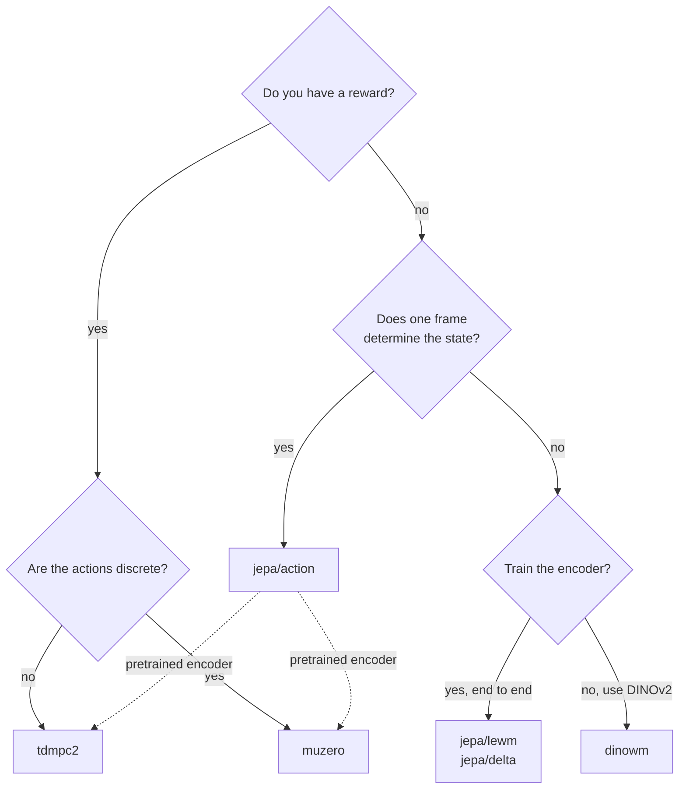

# Models

Four families, one set of parts. They share encoders, latent dynamics and
planners; what separates them is **what signal trains the latent space**.

| family | learning signal | reward? | actions | planner |
| --- | --- | --- | --- | --- |
| [`jepa`](jepa.md) | its own future embeddings | no | continuous | CEM / MPPI |
| [`jepa` (windowed)](lewm.md) | its own future embeddings, end to end | no | continuous | CEM / MPPI |
| [`dinowm`](dinowm.md) | its own future embeddings, frozen encoder | no | continuous | CEM / MPPI |
| [`tdmpc2`](tdmpc2.md) | reward + TD value | yes | continuous | MPPI |
| [`muzero`](muzero.md) | search-improved targets | yes | discrete | MCTS |

The first three share a learning signal and differ in **where the representation
comes from** -- learned in two stages, learned end to end, or not learned at all.
That is the axis [`lewm.md`](lewm.md) and [`dinowm.md`](dinowm.md) are about.

## Choosing



They are complementary rather than competing:

- **No reward, lots of observation.** JEPA. It pretrains on passive video, which
  is abundant and unlabelled, and needs no environment at all.
- **Reward, continuous actions.** TD-MPC2. The natural fit for a robot arm, and
  the value function lets its planner see past its own horizon.
- **Reward, discrete actions.** MuZero. Tree search is the thing to have when the
  action set is small and the payoff is sparse.

The dotted arrows are real: a JEPA encoder is a reasonable initialisation for
either value-based family, and it is one argument.

!!! note "What they have actually achieved on the Franka arm"

    Design fit is not evidence. On this task the JEPA pipeline closes 10–30% of the
    distance to the goal, TD-MPC2's result flips sign between identical runs, and
    MuZero has only a smoke run so far. [Findings](../findings.md) carries the
    measurements, including the negative ones.

```python
pretrained = trained_jepa.encoder

agent = xwm.families.tdmpc2.tdmpc2(action_dim=7, encoder=pretrained)
agent = xwm.families.muzero.muzero(n_actions=15, encoder=pretrained)
```

## What they have in common

Every family is a [`WorldModel`](../reference/core.md#xwm.core.WorldModel), which
means it provides exactly three things the `Trainer` needs:

```python
model.loss(batch, key=key)          # the batch-level objective -> (loss, metrics)
model.prepare_batch(batch, key)     # host-side work, outside jit
model.trainable                     # which parameters the optimizer may touch
```

It also provides the one thing every planner needs:

```python
model.dynamics_fn()                 # (z, a) -> z'
```

That is the entire interface. Anything satisfying it trains and plans like the
built-in families do.

## The registry

For sweeps and config-driven experiments, build by name:

```python
xwm.families.available()
# ['dinowm', 'jepa/action', 'jepa/delta', 'jepa/image', 'jepa/image-lejepa',
#  'jepa/lewm', 'jepa/video', 'jepa/video-lejepa', 'muzero', 'tdmpc2']

model = xwm.families.create("tdmpc2", action_dim=7, observation="state", state_dim=20)
```

The family packages are the better entry point when you already know which model
you want, since they carry the type annotations and the docstrings.

## Observation types

The reward-driven families take either pixels or a state vector, through the same
argument:

=== "State"

    ```python
    agent = xwm.families.tdmpc2.tdmpc2(
        action_dim=7, observation="state", state_dim=20,
    )
    ```

=== "Pixels"

    ```python
    agent = xwm.families.tdmpc2.tdmpc2(
        action_dim=7, observation="image", img_size=64, patch_size=8,
    )
    ```

=== "Your own encoder"

    ```python
    agent = xwm.families.tdmpc2.tdmpc2(action_dim=7, encoder=my_encoder)
    ```

For the value-based families, token output is mean-pooled to a flat latent,
because their dynamics and heads are MLPs over a single vector.
